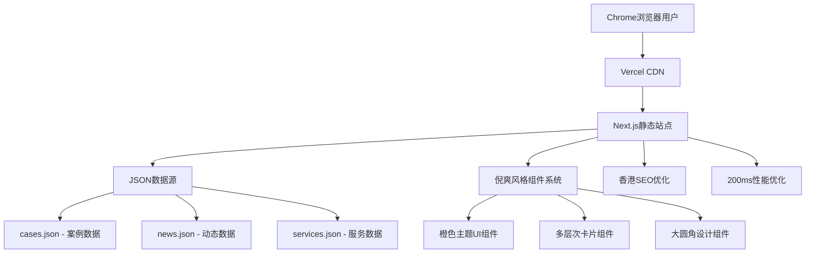

# 设计文档

## 概述

香港速睿森视科技品牌展示网站将采用现代化的静态生成架构，使用Next.js 14技术栈构建。网站将具备200ms首屏加载、Chrome浏览器优化、JSON数据驱动的内容管理和香港市场SEO优化等特性。整体设计风格采用倪爽设计工作室的真实风格特质：橙色主色调、多层次卡片系统、大圆角设计，突出金融科技专业形象。

## 架构设计

### 技术栈选择

- **前端框架**: Next.js 14 (React 18) - 静态生成优化
- **样式方案**: Tailwind CSS - 倪爽风格设计系统
- **动画库**: Framer Motion - 流畅交互动画
- **图标库**: Lucide React - 现代化图标
- **字体**: 系统字体栈 + PingFang SC/TC - 多语言支持
- **数据管理**: JSON文件 + 静态生成 - 便于维护
- **构建工具**: Next.js内置 + 性能优化插件
- **部署**: Vercel - 全球CDN + 200ms加载优化
- **目标浏览器**: Chrome优先，主流浏览器兼容

### 系统架构



### JSON数据驱动架构

网站采用JSON文件驱动的内容管理系统，实现代码与内容分离：

- **静态生成时读取** - 构建时从JSON文件生成静态页面
- **容错机制** - JSON解析错误时使用默认内容
- **版本控制** - JSON文件纳入Git管理，便于追踪变更
- **性能优化** - 预编译JSON数据，避免运行时解析

## 组件和接口设计

### 页面结构

1. **首页 (Home)**
   - Hero区域：品牌主视觉 + 核心价值主张
   - 关于我们：品牌故事简介
   - 产品/服务展示：核心业务亮点
   - 客户案例：成功案例展示
   - 联系方式：快速联系入口

2. **关于我们 (About)**
   - 公司历程：发展时间线
   - 团队介绍：核心团队成员
   - 企业文化：价值观和使命
   - 资质荣誉：认证和奖项

3. **产品/服务 (Products/Services)**
   - 产品分类：清晰的产品线
   - 详细介绍：功能特性说明
   - 技术优势：核心竞争力
   - 应用场景：使用案例

4. **案例展示 (Cases)**
   - 项目展示：成功案例
   - 客户评价：用户反馈
   - 行业覆盖：服务领域

5. **联系我们 (Contact)**
   - 联系表单：在线咨询
   - 联系信息：地址、电话、邮箱
   - 地图定位：办公地址
   - 社交媒体：官方账号

### 核心组件设计

#### 1. 布局组件
```typescript
// Layout组件接口
interface LayoutProps {
  children: React.ReactNode;
  title?: string;
  description?: string;
  keywords?: string;
}

// Header组件
interface HeaderProps {
  logo: string;
  navigation: NavigationItem[];
  isScrolled: boolean;
}

// Footer组件
interface FooterProps {
  companyInfo: CompanyInfo;
  socialLinks: SocialLink[];
  quickLinks: QuickLink[];
}
```

#### 2. 内容组件
```typescript
// Hero区域组件
interface HeroSectionProps {
  title: string;
  subtitle: string;
  backgroundImage: string;
  ctaButton: ButtonProps;
}

// 产品卡片组件
interface ProductCardProps {
  id: string;
  title: string;
  description: string;
  image: string;
  features: string[];
  link: string;
}

// 案例展示组件
interface CaseStudyProps {
  id: string;
  title: string;
  client: string;
  category: string;
  description: string;
  images: string[];
  results: string[];
}
```

## 数据模型

### JSON数据文件结构

#### 1. cases.json - 项目案例数据
```typescript
interface CaseStudy {
  id: string;
  title: string;
  client: string;
  industry: "金融科技" | "数字化转型" | "系统开发" | "UI/UX设计";
  description: string;
  challenge: string;
  solution: string;
  results: {
    metric: string;
    value: string;
    description: string;
  }[];
  images: {
    thumbnail: string;
    gallery: string[];
  };
  technologies: string[];
  duration: string;
  testimonial?: {
    content: string;
    author: string;
    position: string;
    company: string;
  };
  featured: boolean; // 是否在首页展示
}

// cases.json 文件结构
{
  "cases": CaseStudy[],
  "lastUpdated": "2025-01-02T00:00:00Z"
}
```

#### 2. news.json - 公司动态数据
```typescript
interface NewsItem {
  id: string;
  title: string;
  summary: string;
  content: string;
  category: "公司动态" | "行业洞察" | "技术分享" | "客户成功";
  publishDate: string;
  author: string;
  tags: string[];
  image?: string;
  featured: boolean; // 是否在首页展示
}

// news.json 文件结构
{
  "news": NewsItem[],
  "lastUpdated": "2025-01-02T00:00:00Z"
}
```

#### 3. services.json - 服务项目数据
```typescript
interface Service {
  id: string;
  name: string;
  category: "系统规划" | "UI/UX设计" | "产品咨询" | "运营策划";
  description: string;
  features: string[];
  benefits: string[];
  process: {
    step: number;
    title: string;
    description: string;
  }[];
  pricing?: {
    type: "固定价格" | "按项目报价" | "咨询定制";
    startingPrice?: string;
    description: string;
  };
  icon: string;
  featured: boolean;
}

// services.json 文件结构
{
  "services": Service[],
  "lastUpdated": "2025-01-02T00:00:00Z"
}
```

### 数据加载和容错机制

```typescript
// 数据加载工具函数
async function loadJSONData<T>(filename: string, fallback: T): Promise<T> {
  try {
    const data = await import(`../data/${filename}`);
    return data.default;
  } catch (error) {
    console.warn(`Failed to load ${filename}, using fallback data`);
    return fallback;
  }
}

// 数据验证函数
function validateCaseData(cases: any[]): CaseStudy[] {
  return cases.filter(case => 
    case.id && case.title && case.client && case.industry
  );
}
```

## 错误处理和容错机制

### JSON数据容错策略

1. **数据加载容错**
   ```typescript
   // JSON数据加载容错
   async function loadCasesData(): Promise<CaseStudy[]> {
     try {
       const data = await import('../data/cases.json');
       return validateCaseData(data.cases);
     } catch (error) {
       console.warn('Failed to load cases.json, using fallback data');
       return getFallbackCases();
     }
   }
   
   // 数据验证函数
   function validateCaseData(cases: any[]): CaseStudy[] {
     return cases.filter(case => {
       const isValid = case.id && case.title && case.client && case.industry;
       if (!isValid) {
         console.warn('Invalid case data:', case);
       }
       return isValid;
     });
   }
   
   // 备用数据
   function getFallbackCases(): CaseStudy[] {
     return [
       {
         id: 'fallback-1',
         title: '金融APP设计优化',
         client: '保密客户',
         industry: '金融科技',
         description: '专业的金融APP界面设计和用户体验优化服务',
         // ... 其他必要字段
       }
     ];
   }
   ```

2. **渐进式数据展示**
   - 核心内容优先加载
   - 次要内容异步加载
   - 加载失败时显示占位符

### 浏览器兼容性设计

1. **Chrome浏览器优化**
   ```css
   /* Chrome特定优化 */
   @supports (backdrop-filter: blur(10px)) {
     .glass-effect {
       backdrop-filter: blur(10px);
       background: rgba(255, 255, 255, 0.8);
     }
   }
   
   /* Chrome性能优化 */
   .smooth-scroll {
     scroll-behavior: smooth;
   }
   
   .gpu-accelerated {
     transform: translateZ(0);
     will-change: transform;
   }
   ```

2. **优雅降级方案**
   ```css
   /* 现代浏览器特性检测 */
   @supports (display: grid) {
     .card-grid {
       display: grid;
       grid-template-columns: repeat(auto-fit, minmax(300px, 1fr));
       gap: 24px;
     }
   }
   
   /* 降级方案 */
   @supports not (display: grid) {
     .card-grid {
       display: flex;
       flex-wrap: wrap;
     }
     
     .card-grid > * {
       flex: 1 1 300px;
       margin: 12px;
     }
   }
   ```

3. **性能监控和错误上报**
   ```typescript
   // 性能监控
   function monitorWebVitals() {
     if ('PerformanceObserver' in window) {
       const observer = new PerformanceObserver((list) => {
         for (const entry of list.getEntries()) {
           if (entry.entryType === 'largest-contentful-paint') {
             console.log('LCP:', entry.startTime);
           }
         }
       });
       observer.observe({ entryTypes: ['largest-contentful-paint'] });
     }
   }
   
   // 错误上报
   window.addEventListener('error', (event) => {
     console.error('JavaScript Error:', event.error);
     // 可选：发送到错误监控服务
   });
   ```

### 错误边界组件

```typescript
interface ErrorBoundaryState {
  hasError: boolean;
  error?: Error;
  errorInfo?: ErrorInfo;
}

class ErrorBoundary extends Component<Props, ErrorBoundaryState> {
  constructor(props: Props) {
    super(props);
    this.state = { hasError: false };
  }

  static getDerivedStateFromError(error: Error): ErrorBoundaryState {
    return { hasError: true, error };
  }

  componentDidCatch(error: Error, errorInfo: ErrorInfo) {
    console.error('Error Boundary caught an error:', error, errorInfo);
    this.setState({ errorInfo });
  }

  render() {
    if (this.state.hasError) {
      return (
        <div className="card-white text-center p-8">
          <h2 className="text-xl font-semibold mb-4 text-text-primary">
            抱歉，页面出现了问题
          </h2>
          <p className="text-text-secondary mb-6">
            我们正在努力修复这个问题，请稍后再试。
          </p>
          <button 
            className="btn-primary"
            onClick={() => window.location.reload()}
          >
            刷新页面
          </button>
        </div>
      );
    }

    return this.props.children;
  }
}
```

## 测试策略

### 测试层级

1. **单元测试**
   - 组件功能测试
   - 工具函数测试
   - 使用Jest + React Testing Library

2. **集成测试**
   - 页面交互测试
   - API集成测试
   - 使用Cypress

3. **性能测试**
   - 页面加载速度测试
   - 图片优化效果测试
   - 使用Lighthouse CI

4. **可访问性测试**
   - 键盘导航测试
   - 屏幕阅读器兼容性
   - 使用axe-core

### 测试覆盖率目标

- 组件测试覆盖率：≥ 80%
- 关键业务逻辑覆盖率：≥ 90%
- E2E测试覆盖核心用户流程

## 200ms性能优化策略

### Chrome浏览器优化

1. **首屏200ms加载目标**
   - 关键CSS内联，避免渲染阻塞
   - 预加载关键资源 (preload, prefetch)
   - 使用Chrome DevTools性能分析优化
   - 利用Chrome的V8引擎优化JavaScript执行

2. **资源优化**
   - WebP格式图片 + AVIF格式备选
   - 字体子集化，仅加载中文常用字符
   - Brotli压缩算法 (Chrome原生支持)
   - HTTP/2推送关键资源

3. **静态生成优化**
   - Next.js静态生成 (SSG) 预渲染所有页面
   - JSON数据在构建时预处理
   - 关键路径CSS提取和内联
   - 预生成所有路由的HTML

### 加载性能策略

1. **代码分割**
   - 路由级别的代码分割
   - 组件懒加载 (React.lazy + Suspense)
   - 第三方库按需加载
   - JSON数据按页面分割

2. **缓存策略**
   - 静态资源永久缓存 (immutable)
   - CDN边缘缓存优化
   - 浏览器缓存策略
   - Service Worker预缓存

3. **网络优化**
   - DNS预解析 (dns-prefetch)
   - 连接预热 (preconnect)
   - 资源预加载 (preload)
   - 关键资源优先级设置

### 运行时性能

1. **渲染优化**
   - React.memo优化重渲染
   - 虚拟滚动处理案例列表
   - 防抖和节流处理用户输入
   - CSS-in-JS避免，使用Tailwind CSS

2. **Chrome特性利用**
   - Intersection Observer API (懒加载)
   - Web Vitals监控 (CLS, LCP, FID)
   - Performance Observer性能监控
   - Chrome User Timing API

## 香港市场SEO优化设计

### 核心关键词策略

1. **主要关键词**
   - "金融APP设计" - 首页、服务页面重点优化
   - "科技金融" - 关于我们、案例页面
   - "系统开发" - 服务页面、技术博客
   - "系统性能优化" - 案例页面、技术分享
   - "软件开发" - 服务页面、项目案例

2. **香港本地化关键词**
   - "香港金融科技公司"
   - "香港APP设计公司"
   - "香港系统开发"
   - "香港数字化转型"
   - "香港UI/UX设计"

### 技术SEO实现

1. **元数据管理**
   ```typescript
   // SEO配置
   const seoConfig = {
     defaultTitle: "香港速睿森视科技 - 金融APP设计与系统开发专家",
     titleTemplate: "%s | 香港速睿森视科技",
     description: "专业的金融APP设计、科技金融解决方案、系统开发和性能优化服务。服务香港及大陆市场，助力企业数字化转型。",
     keywords: ["金融APP设计", "科技金融", "系统开发", "系统性能优化", "软件开发", "香港"],
     openGraph: {
       type: "website",
       locale: "zh_HK",
       alternateLocales: ["zh_CN", "en_US"],
       siteName: "香港速睿森视科技有限公司"
     }
   };
   ```

2. **结构化数据**
   ```json
   {
     "@context": "https://schema.org",
     "@type": "Organization",
     "name": "香港速睿森视科技有限公司",
     "alternateName": "Susense Technology Co., Limited",
     "url": "https://susense.hk",
     "logo": "https://susense.hk/logo.png",
     "address": {
       "@type": "PostalAddress",
       "addressLocality": "香港",
       "addressRegion": "油尖旺区",
       "streetAddress": "大角咀通州街雲之端1011室"
     },
     "contactPoint": {
       "@type": "ContactPoint",
       "telephone": "+852-xxxx-xxxx",
       "contactType": "customer service",
       "areaServed": ["HK", "CN"],
       "availableLanguage": ["zh-HK", "zh-CN", "en"]
     },
     "sameAs": [
       "https://linkedin.com/company/susense",
       "https://github.com/susense"
     ]
   }
   ```

3. **多语言SEO**
   - hreflang标签配置
   - 语言特定的URL结构
   - 本地化内容策略

### 内容SEO策略

1. **页面优化**
   - 首页：突出"金融APP设计"和"科技金融"
   - 服务页：详细介绍"系统开发"和"性能优化"
   - 案例页：展示"软件开发"成功案例
   - 博客页：技术分享和行业洞察

2. **内容结构**
   - H1标签包含主要关键词
   - H2-H6标签布局长尾关键词
   - 图片alt标签优化
   - 内部链接策略

## 响应式设计规范

### 断点设计

```css
/* Tailwind CSS断点 */
--breakpoint-sm: 640px;   /* 移动端 */
--breakpoint-md: 768px;   /* 平板端 */
--breakpoint-lg: 1024px;  /* 桌面端 */
--breakpoint-xl: 1280px;  /* 大屏幕 */
--breakpoint-2xl: 1536px; /* 超大屏 */
```

### Chrome移动端优化

1. **触摸交互优化**
   ```css
   /* 触摸目标最小尺寸 */
   .touch-target {
     min-height: 44px;
     min-width: 44px;
   }
   
   /* 触摸反馈 */
   .btn:active {
     transform: scale(0.98);
     transition: transform 0.1s ease;
   }
   
   /* 滚动优化 */
   .scroll-container {
     -webkit-overflow-scrolling: touch;
     scroll-behavior: smooth;
   }
   ```

2. **移动端性能优化**
   ```css
   /* GPU加速 */
   .mobile-optimized {
     transform: translateZ(0);
     backface-visibility: hidden;
   }
   
   /* 减少重绘 */
   .no-select {
     -webkit-user-select: none;
     user-select: none;
   }
   ```

### 布局适配策略

1. **移动优先设计**
   ```css
   /* 基础移动端样式 */
   .hero-section {
     padding: 40px 20px;
     text-align: center;
   }
   
   .hero-title {
     font-size: 2rem;
     line-height: 1.2;
   }
   
   /* 平板端增强 */
   @media (min-width: 768px) {
     .hero-section {
       padding: 60px 40px;
     }
     
     .hero-title {
       font-size: 2.5rem;
     }
   }
   
   /* 桌面端增强 */
   @media (min-width: 1024px) {
     .hero-section {
       padding: 80px 60px;
     }
     
     .hero-title {
       font-size: 3.5rem;
     }
   }
   ```

2. **灵活的卡片网格**
   ```css
   .card-grid {
     display: grid;
     gap: 16px;
     grid-template-columns: 1fr;
   }
   
   @media (min-width: 640px) {
     .card-grid {
       grid-template-columns: repeat(2, 1fr);
       gap: 20px;
     }
   }
   
   @media (min-width: 1024px) {
     .card-grid {
       grid-template-columns: repeat(3, 1fr);
       gap: 24px;
     }
   }
   
   @media (min-width: 1280px) {
     .card-grid {
       grid-template-columns: repeat(4, 1fr);
     }
   }
   ```

3. **内容优先级处理**
   ```css
   /* 移动端隐藏次要内容 */
   .secondary-content {
     display: none;
   }
   
   @media (min-width: 768px) {
     .secondary-content {
       display: block;
     }
   }
   
   /* 移动端导航简化 */
   .desktop-nav {
     display: none;
   }
   
   .mobile-nav {
     display: block;
   }
   
   @media (min-width: 1024px) {
     .desktop-nav {
       display: flex;
     }
     
     .mobile-nav {
       display: none;
     }
   }
   ```

### 图片响应式处理

```html
<!-- 响应式图片 -->
<picture>
  <source 
    media="(min-width: 1024px)" 
    srcset="hero-desktop.webp 1920w, hero-desktop@2x.webp 3840w"
    sizes="100vw"
  >
  <source 
    media="(min-width: 768px)" 
    srcset="hero-tablet.webp 1024w, hero-tablet@2x.webp 2048w"
    sizes="100vw"
  >
  
</picture>
```

## 倪爽风格设计系统

### 核心设计特质

1. **橙色主色调** - 摆脱传统蓝色限制
2. **多层次卡片系统** - 白色/淡绿/灰色/深色的渐进式组合
3. **大圆角设计** - 16px圆角营造现代感
4. **精致阴影** - 层次分明的阴影系统
5. **流畅交互** - 细腻的hover效果和动画

### 色彩系统

```css
:root {
  /* 主色调 - 橙色系 */
  --primary-orange: #FF8C42;
  --primary-orange-hover: #FF6B35;
  
  /* 卡片背景色 */
  --card-white: #ffffff;
  --card-light-green: #F0FDF4;
  --card-gray: #F1F5F9;
  --card-dark-gray: #64748B;
  --card-dark-blue: #1E293B;
  
  /* 页面背景 */
  --background: #F8F9FA;
  
  /* 文字颜色 */
  --text-primary: #2a2a2a;
  --text-secondary: #666666;
}
```

### 字体系统

```css
/* 系统字体栈 */
font-family: -apple-system, BlinkMacSystemFont, 'Segoe UI', Roboto, 'PingFang SC', 'Hiragino Sans GB', 'Microsoft YaHei', sans-serif;

/* 字体层级 */
--font-hero: 3.5rem;     /* 56px - 主标题 */
--font-section: 2.5rem;  /* 40px - 区块标题 */
--font-h1: 2.25rem;      /* 36px - H1标题 */
--font-h2: 1.875rem;     /* 30px - H2标题 */
--font-h3: 1.5rem;       /* 24px - H3标题 */
--font-h4: 1.25rem;      /* 20px - H4标题 */
--font-large: 1.125rem;  /* 18px - 重要正文 */
--font-regular: 1rem;    /* 16px - 常规正文 */
--font-small: 0.875rem;  /* 14px - 辅助文字 */
--font-caption: 0.75rem; /* 12px - 说明文字 */
```

### 卡片组件设计

```css
/* 白色卡片 - 基础内容 */
.card-white {
  background: var(--card-white);
  border-radius: 16px;
  padding: 32px;
  box-shadow: 0 4px 20px rgba(0,0,0,0.08);
  border: 1px solid #E5E7EB;
  transition: all 0.3s ease;
}

/* 淡绿卡片 - 特色服务 */
.card-light-green {
  background: var(--card-light-green);
  border-radius: 16px;
  padding: 32px;
  box-shadow: 0 4px 20px rgba(34, 197, 94, 0.1);
  border: 1px solid #BBF7D0;
}

/* 深色卡片 - 专业服务 */
.card-dark-blue {
  background: var(--card-dark-blue);
  border-radius: 16px;
  padding: 32px;
  box-shadow: 0 8px 32px rgba(30, 41, 59, 0.4);
  color: white;
}

/* 橙色卡片 - 重点突出 */
.card-orange {
  background: var(--primary-orange);
  border-radius: 16px;
  padding: 32px;
  box-shadow: 0 8px 32px rgba(255, 140, 66, 0.3);
  color: white;
}
```

### 按钮设计系统

```css
/* 橙色主按钮 */
.btn-primary {
  background: var(--primary-orange);
  color: white;
  border-radius: 12px;
  padding: 16px 32px;
  font-weight: 600;
  transition: all 0.3s cubic-bezier(0.4, 0, 0.2, 1);
}

.btn-primary:hover {
  background: var(--primary-orange-hover);
  transform: translateY(-2px);
  box-shadow: 0 12px 32px rgba(255, 140, 66, 0.5);
}

/* 黑色按钮 */
.btn-black {
  background: #000000;
  color: white;
  border-radius: 12px;
  padding: 16px 32px;
  font-weight: 600;
  transition: all 0.3s cubic-bezier(0.4, 0, 0.2, 1);
}

.btn-black:hover {
  background: #1F2937;
  transform: translateY(-2px);
  box-shadow: 0 12px 32px rgba(0, 0, 0, 0.6);
}
```

### 交互动画设计

```css
/* 卡片hover效果 */
.card:hover {
  transform: translateY(-4px);
  box-shadow: 0 12px 40px rgba(0,0,0,0.15);
}

/* 按钮按下动画 */
@keyframes buttonPress {
  0% { transform: translateY(0) scale(1); }
  50% { transform: translateY(1px) scale(0.98); }
  100% { transform: translateY(-2px) scale(1); }
}

.btn:active {
  animation: buttonPress 0.2s ease-out;
}

/* 页面进入动画 */
@keyframes fadeInUp {
  from {
    opacity: 0;
    transform: translateY(20px);
  }
  to {
    opacity: 1;
    transform: translateY(0);
  }
}
```

### 间距系统

- **基础单位**: 8px
- **间距比例**: 8px, 16px, 24px, 32px, 48px, 64px, 80px
- **卡片内边距**: 32px (大卡片), 24px (中卡片), 16px (小卡片)
- **页面布局**: 最大宽度1280px，左右边距20px